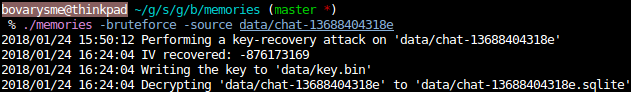

# memories

A key-recovery attack for LINE for Android's chat backup encryption.

LINE for Android has a feature to back up individual chats to a ZIP file. Each
backup contains images in plaintext and a weakly encrypted chat database, which
can be recovered in fifteen minutes at most on a CPU supporting
[AES-NI](https://en.wikipedia.org/wiki/AES_instruction_set).

## Usage

Before anything else, compile the package with `go build` and extract the
backup archive (`LINE_Android-backup-chat<id>.zip`). The encrypted chat
database is the `linebackup/chat/chat<id>` file (and *not* the one with the
`.extra` extension). Note: `chat<id>` and `chat<id>.extra` need to be in the
same directory for the decryption program to work.

Decrypt an encrypted chat database (requires both your MID and your chat
partner's):
```
./memories -source <path to the encrypted chat db> -oid <your MID> -tid <your chat partner's MID>
```

Recover the key of an encrypted chat database and decrypt it:
```
./memories -bruteforce -source <path to the encrypted chat db>
```

## Write-up
### Introduction

Every LINE user has an internal ID that starts with `u` followed by 32 hex
digits (e.g. `u61726520762e206375746520f09f929c`), which is refered to as
`PROFILE_MID` or `tmId` in the Android app. (This ID is different from the one
you can set in the app, and from the `userId` exposed by the LINE Messaging
API.) While it isn't visible to end users, it isn't secret either: I recovered
mine and my chat partners' using LINE for Google Chrome and Chrome's developer
tools.

When a chat backup is created, both IDs are concatenated and
[`hashCode()`](https://en.wikipedia.org/wiki/Java_hashCode()#The_java.lang.String_hash_function)ed.
The resulting 32-bit integer is then used as an initialization vector (IV) to
derive a 128-bit encryption key, and the chat database is encrypted using
AES-ECB with PKCS#5 padding.

After finding both IDs and reimplementing the encryption scheme, I was able to
successfully decrypt a backup made from my account.

### Key-recovery

On top of the encryption key being derived from a 32-bit integer, the key
derivation function (KDF) is fast and only called once. This effectively
reduces the size of the key space to 2^32, which can be searched quickly.

A simple way to search the key space is to derive a key from every possible IV,
and use it to try to decrypt the first 16-byte block of the ciphertext (which
is expected to be `SQLite format 3\x00`).

Using this attack, I was able to recover a key in less than 4 minutes on a 7
years old laptop (i5-2540M @ 2.60GHz).



### Possible improvements

The KDF has collisions (e.g. the IVs -1147136985, -1147146969, -1147157209...
all yield the same key), which leads me to believe this attack could be
improved.

### Lessons learned

- Do not use 32-bit IVs.
- Do not use `hashCode()` as a cryptographic hash function.
- Do not implement your own KDF.
- Use a slow KDF to prevent brute-force attacks.
- [Do not use AES in ECB mode.](https://i.imgur.com/CBdiOQ8.png)

## License

This project is licensed under the terms of the MIT license, except for the
contents of the `crypto` directory which are licensed under the
[Go BSD-style license](crypto/LICENSE).
